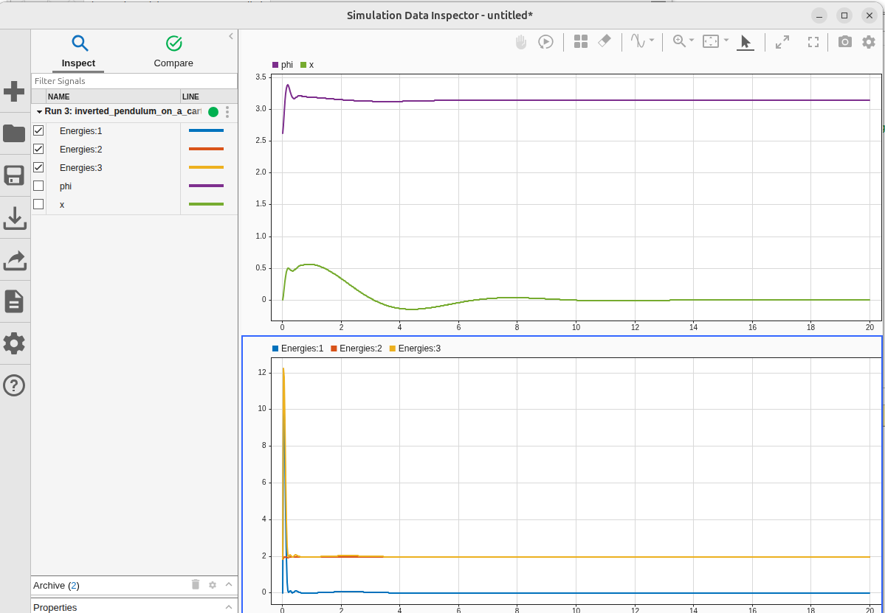

# Inverted Pendulum

Głównym cel to utrzymanie systemu pozycji pionowej.

### Model wózka
Modelu wózka z wahadłem:

### Wyniki symulacji
Położenie wózka oraz kąt wahadła

### Notatki
**[Przejdź do dokumentacji w Google Docs](https://docs.google.com/document/d/18R_7BUF4b25SAKLMLjVrlbADpHYMjgFTGn7Dtx8Om8U/edit?tab=t.0)**
